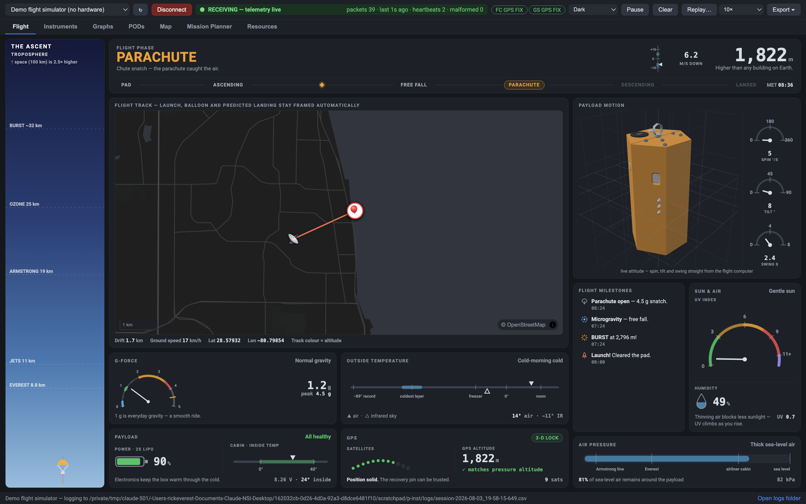
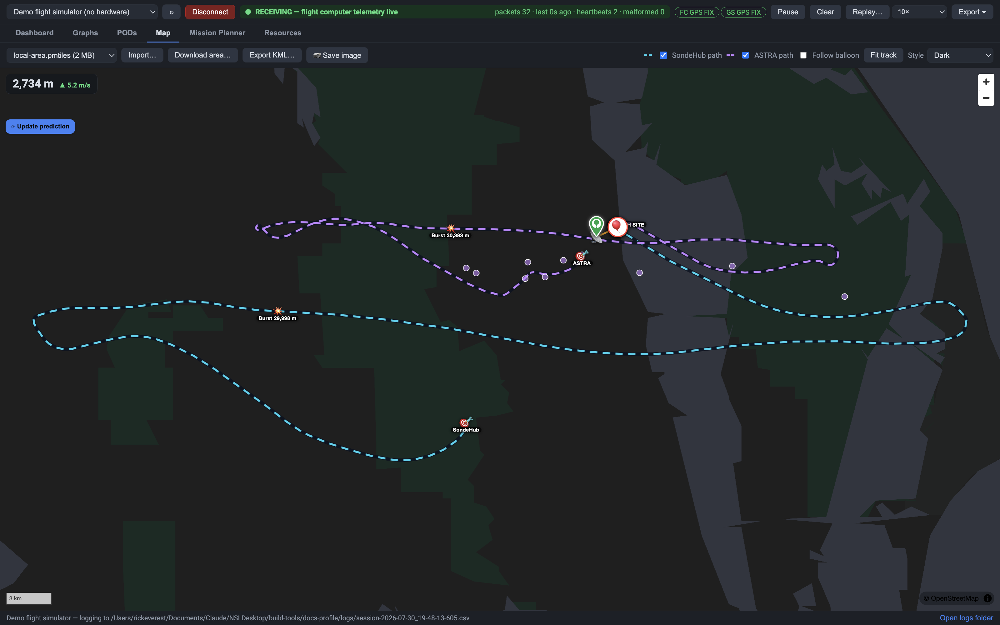
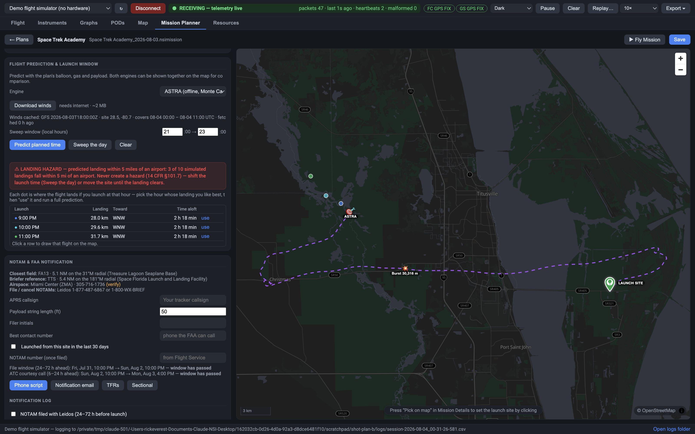

# NSI® Mission Control

**Plan, fly, and recover a high-altitude balloon mission — from one screen, built for classrooms.**

NSI Mission Control is the ground-station software for the **Near Space Investigations (NSI)** program from Atlantis Educational Services. It connects to an NSI Ground Station over USB, receives live telemetry from an NSI Flight Computer riding a balloon to the edge of space, and turns a school field into a mission control room: live map, instruments, flight prediction, antenna pointing, and a complete record of the flight for the classroom afterwards.

It is free to download, runs on Windows, macOS and Linux (including Raspberry Pi), and needs **no account, no licence key, and no setup** — install it, plug in the Ground Station, and fly.

**[⭳ Download the latest release](../../releases/latest)** · [What you need](#what-you-need) · [Install](#install)

---

## Why it exists

A high-altitude balloon flight is one of the best science lessons there is: a student-built payload climbs through −60 °C at 100,000+ feet, photographs the curvature of the Earth, bursts, and parachutes home. But the flying part has traditionally demanded ham-radio experience, hand-rolled tracking scripts, and a specialist at the keyboard.

Mission Control removes that barrier. A teacher and a group of students can plan a launch, check the airspace, predict the landing, fly the mission, and drive to the payload — without a support call. Every step happens in plain language on one screen, and everything the flight produces is saved automatically.

## What it does

### 🎈 Live flight, as it happens

The **Flight** tab is the mission display — built to be read from across the room, by people who are standing up and holding an antenna:

- **What the flight is doing, in words** — ON THE PAD, ASCENDING, FREE FALL, PARACHUTE, DESCENDING, LANDED — with the altitude compared to something human ("above airliner cruise", "above 94% of the atmosphere")
- **A map that frames itself**, always holding the launch site, the whole track, the balloon and the predicted landing, with the track coloured by altitude so you can see where burst happened
- **The payload turning in 3-D**, posed live from its own motion sensor, so a class can watch it spin and swing on the way up
- **A milestone log** that writes the flight down as it happens: launch, Everest, the jet stream, cloud, BURST, weightlessness, parachute, landing
- **Six instruments** — G-force, outside temperature, air pressure, payload power, GPS and sun — each a scale with a pointer and a plain-English word, so nothing needs interpreting

The **Instruments** tab is the same flight as numbers: every gauge and readout at once, antenna pointing, live charts, pod lights, and a link status that always says what the radio is doing in words, not codes.

### 🗺️ Offline maps and recovery

The **Map** tab tracks the flight over street or terrain maps that can be **downloaded ahead of time** — because launch sites rarely have good cell service. After burst, the live landing prediction updates from the balloon's actual descent, so the chase crew drives toward where the payload *is going*, not where it was.

### 📋 Mission Planner — the flight before the flight

Plan the entire mission days ahead, from your desk:

- **Launch site picker** with the Ground Station's own GPS as one-click input
- **Gas fill calculator** — balloon size, payload weight, target ascent rate in, litres of helium and neck lift out
- **Flight prediction from real forecast winds** — launch-time sweep shows how the landing zone moves hour by hour, so you pick the calmest window
- **Airspace and NOTAM check** — nearby airports and active notices, before you commit
- **Launch-day weather panel** and a **pre-flight checklist** the class works through together
- **Printable mission pack** — one PDF with the plan, prediction, checklist and contacts, ready for the clipboard
- Plans live in a **library**: draft → flown, with the recording attached to the plan afterwards

### 🛰️ PODs — student experiments

Up to three student-built experiment pods ride along, each with its own sensors. The **PODs** tab shows each pod's link and data live, so every team watches their own experiment fly.

### 📈 Everything is recorded

Every session writes a CSV as packets arrive — no "did you remember to record?" moment. **Replay** any recording at up to 10× to relive the flight in class, and **export** chart data for analysis in a spreadsheet. The telemetry format is plain comma-separated text a science class can open anywhere.

### 🔧 Device Setup — the hardware side, without a toolbox

- **Firmware updates** delivered automatically from the Atlantis firmware service — downloaded once, verified cryptographically, then installable offline. The app checks for device updates the way it checks for its own.
- **Flight logs** — download the Flight Computer's SD-card recordings over USB, with checksum verification
- **Radio pairing** — read and set the radio network so multiple classrooms can fly at the same field without crosstalk
- **Genuine-hardware check** — each NSI board carries a factory-provisioned cryptographic identity the app verifies

### 🎓 Try it with no hardware at all

Pick **"Demo flight simulator"** from the port list and the app flies a scripted balloon mission — real telemetry format, live map, working instruments. Evaluate the software, train a class, or rehearse a launch day, all before the kit arrives.

### 📚 The manuals travel with the app

The **Resources** tab carries three complete documents, readable in-app and offline, each with a printable PDF:

- **Quick Start Guide** — download to planned mission in a few pages
- **User Manual** — every tab, every control, and why it behaves the way it does
- **Complete Guide to Launching High Altitude Balloons** — hardware, physics, launch-day procedure, and regulations country by country

## What you need

| | |
|---|---|
| **Hardware** | An NSI Ground Station (USB) and an NSI Flight Computer — the flight kit from the NSI program. No hardware yet? The built-in demo simulator runs everything. |
| **Computer** | Windows 10/11 (64-bit) · macOS 12+ (Apple Silicon or Intel) · 64-bit Linux with glibc 2.28+ (Ubuntu 20.04+, Raspberry Pi OS 64-bit on Pi 4/5) |
| **Internet** | Not required to fly. Needed once for device firmware, and when planning for forecasts, map downloads and airspace data. Do the once-per-machine downloads before a trip — everything then works offline at the launch site. |

## Install

Grab the file for your machine from the **[latest release](../../releases/latest)**:

| Platform | File |
|---|---|
| Windows 10/11 | `NSI-Mission-Control-Setup-<version>.exe` |
| macOS — Apple Silicon (M-series) | `NSI-Mission-Control-<version>-arm64.dmg` |
| macOS — Intel | `NSI-Mission-Control-<version>.dmg` |
| Linux x64 | `NSI-Mission-Control-<version>.AppImage` or `nsi-mission-control_<version>_amd64.deb` |
| Linux arm64 / Raspberry Pi 4/5 | `NSI-Mission-Control-<version>-arm64.AppImage` or `nsi-mission-control_<version>_arm64.deb` |

Not sure which Mac you have? **Apple menu → About This Mac** — an "M" chip means Apple Silicon.

The app updates itself: when a new version is released, it offers the update in-app.

### First launch on an unsigned build

Code-signing certificates are in progress with Apple and Microsoft. Until they land, your computer warns you once — the software is fine; it simply has no certificate attached yet:

- **Windows** — SmartScreen says "Windows protected your PC": click **More info → Run anyway**
- **macOS 15 (Sequoia) or later** — open it once and let it be blocked, then **System Settings → Privacy & Security**, scroll down, **Open Anyway**
- **macOS 14 or earlier** — right-click the app in Applications → **Open** → **Open**
- **Linux AppImage** — `chmod +x` the file, then run it; **.deb** — `sudo apt install ./<file>.deb`

Once certificates are issued this section disappears and installs are prompt-free.

## Device firmware

Flight Computer and Ground Station firmware comes from the Atlantis firmware service, built into the app — nothing to configure. Every image is **cryptographically signed**, and the app verifies the signature before a single byte is written to a board. Firmware downloads once per machine and then installs offline, so update at school, not at the launch site.

## Support

Questions about a kit, the software, or a flight: **[scientificsales.com](https://www.scientificsales.com)**

Include your Mission Control version (**Help → About**) and, for flight questions, the session CSV (**Export** on the toolbar).

Issues and pull requests on this repository are not monitored — it distributes the released installers; the application source is maintained privately.

---

© 2026 Atlantis Educational Services. All rights reserved.
NSI® and NSI® Mission Control are trademarks of Atlantis Educational Services.

The software is licensed, not sold. Redistribution of the installers and reverse engineering of the application or device firmware are not permitted. Third-party components are credited in Appendix B of the User Manual, inside the app.
